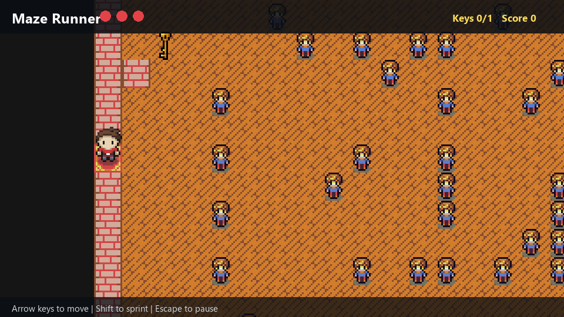

# Maze Runner

Maze Runner is a Java/LibGDX desktop game built for the Fundamentals of Programming course. The player navigates tile-based maze levels, collects keys, avoids traps and enemies, and reaches the exit while managing health and score.



The preview above is rendered from the repository's own assets and level data.

## Features

- Tile-map loading from `.properties` level files.
- Player movement, collision boxes, camera following, and animated sprites.
- Interactive entities: walls, keys, hearts, speed boosts, traps, enemies, entry points, and exits.
- Menu, pause, result screens, HUD counters, sound effects, and background music.
- Optional custom map loading through the desktop file chooser.
- Debug rendering interfaces for collision and entity visualization.

## Tech Stack

- Java 17
- LibGDX 1.12
- Gradle
- LWJGL3 desktop backend

## Run Locally

From the project root:

```powershell
.\gradlew.bat desktop:run
```

On macOS or Linux:

```bash
./gradlew desktop:run
```

## Controls

- Arrow keys: move
- Left Shift: sprint
- Escape: pause / return to menu

## Repository Structure

```text
core/src/de/tum/cit/fop/maze/          Core game screens and map logic
core/src/de/tum/cit/fop/maze/entities/ Entity classes for gameplay objects
core/src/de/tum/cit/fop/maze/enums/    Direction enum
core/src/de/tum/cit/fop/maze/utils/    Animation helpers
desktop/src/.../DesktopLauncher.java   Desktop entry point
assets/                                Sprites, sounds, fonts, and map assets
maps/                                  Example level files
```

## Gameplay Goal

Collect all required keys, avoid losing all health to enemies and traps, and reach the exit. Hearts restore health, speed props provide temporary movement boosts, and the HUD tracks key progress and score.
