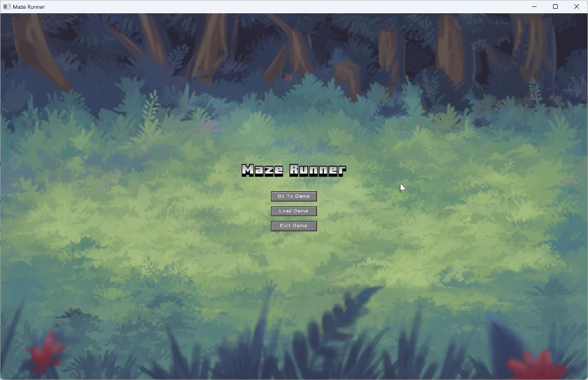
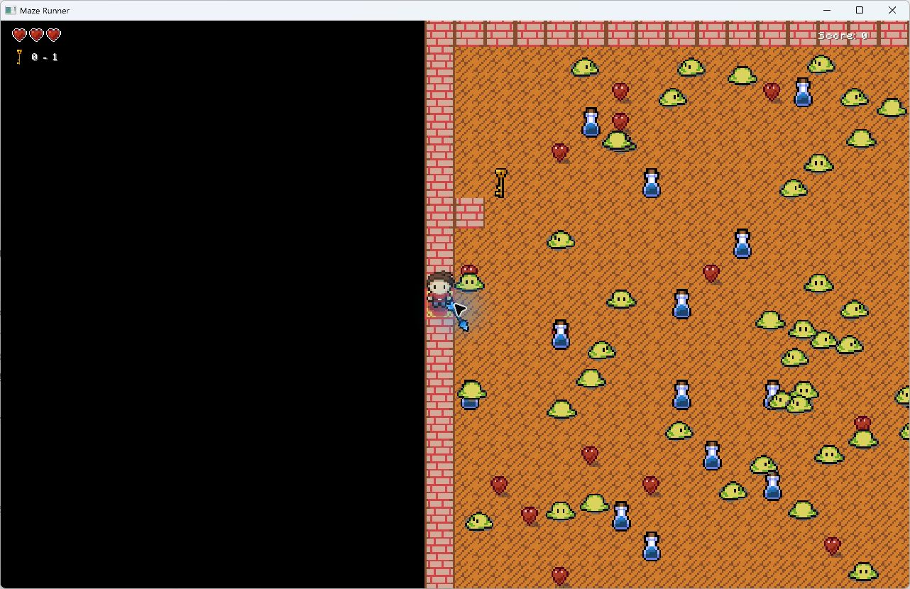
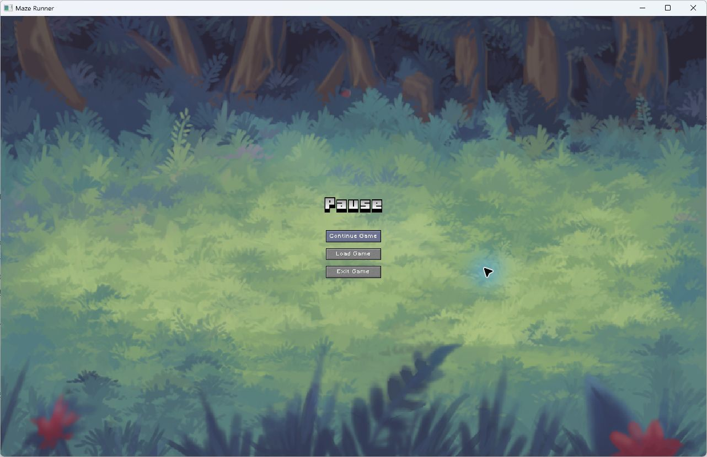
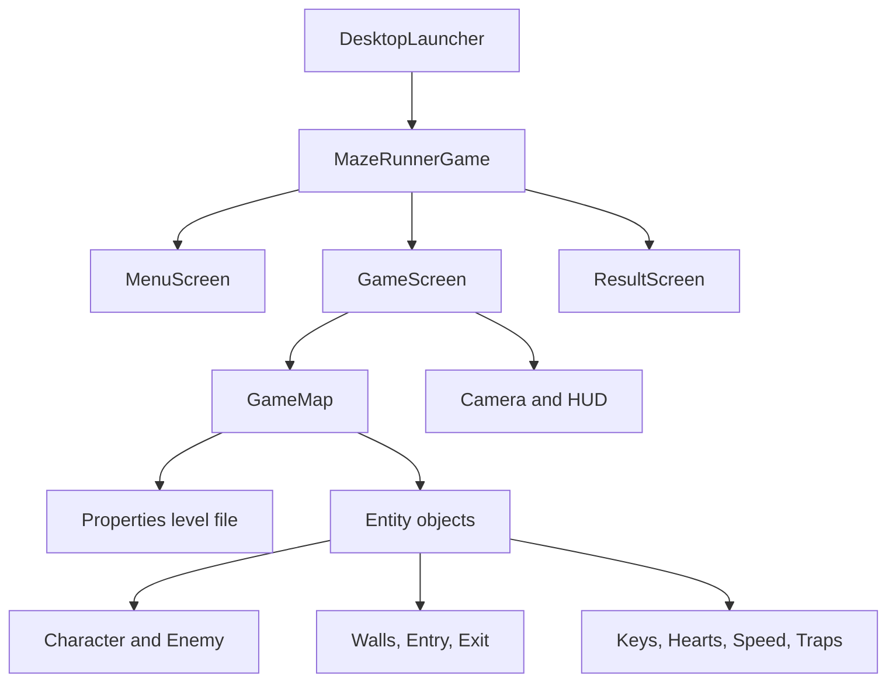

# Maze Runner


Maze Runner is a Java/LibGDX desktop game developed as a team project for TUM's Fundamentals of Programming course. It turns small `.properties` files into playable tile maps and combines animated movement, collision handling, enemy behavior, collectibles, audio, scoring, and screen-state management in one complete gameplay loop.

The goal is simple: collect every key, survive enemies and traps, then reach an unlocked exit. The implementation is deliberately object-oriented: screens coordinate application state, `GameMap` builds a level from data, and entity classes own their rendering and interaction behavior.

<table>
  <tr>
    <td width="50%"></td>
    <td width="50%"></td>
  </tr>
  <tr>
    <td align="center"><strong>Desktop game shell</strong><br/>Start the built-in level, open a custom map, or exit through a LibGDX Scene2D menu.</td>
    <td align="center"><strong>Live gameplay</strong><br/>Camera-following level view with health, key progress, score, enemies, hearts, and speed boosts.</td>
  </tr>
</table>

<p align="center">
  
</p>
<p align="center"><strong>Pause and resume</strong><br/>Escape stops active movement and returns to a state-aware menu that can resume the same run or load another map.</p>

All screenshots above were captured from the repository's desktop build running locally, not from mock-ups.

## Gameplay systems

| Area | Implemented behavior |
|---|---|
| Player | Four-direction animated movement, camera tracking, sprinting, health, temporary invulnerability after damage, and an exit-direction indicator |
| Level goal | Collect every key to unlock the exit; reaching an unlocked exit awards points and completes the run |
| Enemies | Random patrol outside detection range, simple pursuit inside a 256-pixel warning radius, wall avoidance, contact damage, and removal after a successful hit |
| World objects | Walls, entry points, locked/unlocked exits, single-use traps, keys, randomly placed hearts, and temporary double-speed pickups |
| Feedback | Three-heart HUD with quarter-heart states, key counter, score, sound effects, looping menu/game music, and win/lose result screens |
| Desktop UX | Main menu, pause/continue flow, scroll-wheel camera zoom, and native file chooser for compatible custom maps |

Five example levels are included. Their sizes and entity mixes vary from a compact maze to a larger encounter-heavy map, so the same game logic is exercised against different data rather than hard-coded coordinates.

## Architecture



- `MazeRunnerGame` owns shared rendering resources, audio transitions, and navigation between menu, gameplay, and result screens.
- `GameScreen` coordinates the camera, pause behavior, HUD, and win/lose transitions.
- `GameMap` parses level data, creates entities, updates collectible state, and unlocks exits after the final key.
- `BaseEntity` and `BlockEntity` provide reusable position, size, collision-box, and movement-direction state.
- `Renderable` and `DebugRenderable` keep normal drawing separate from optional collision/debug visualization.

## Data-driven level format

Each non-metadata line maps an integer grid coordinate to an entity type:

```properties
0,8=1
4,8=5
8,8=2
3,5=0
6,4=4
```

| Value | Entity |
|---:|---|
| `0` | Wall |
| `1` | Player entry point |
| `2` | Exit |
| `3` | Trap |
| `4` | Enemy |
| `5` | Key |

Hearts and speed boosts are distributed at runtime according to the loaded map dimensions. A custom file selected from the menu uses the same schema as the five examples in `assets/maps/`.

## Run locally

Requirements: JDK 17. The Gradle wrapper downloads the remaining build dependencies.

Windows PowerShell:

```powershell
.\gradlew.bat desktop:run
```

macOS or Linux:

```bash
./gradlew desktop:run
```

Build without starting the window:

```powershell
.\gradlew.bat build
```

## Controls

| Input | Action |
|---|---|
| Arrow keys | Move |
| Left Shift | Sprint while held |
| Escape | Pause and return to the state-aware menu |
| Mouse wheel | Zoom the gameplay camera |

## Repository layout

```text
core/src/de/tum/cit/fop/maze/          Screens, game state, map loading, and shared assets
core/src/de/tum/cit/fop/maze/entities/ Player, enemy, world-object, and pickup classes
core/src/de/tum/cit/fop/maze/enums/    Movement direction
core/src/de/tum/cit/fop/maze/utils/    Sprite-sheet animation helper
desktop/src/.../DesktopLauncher.java   LWJGL3 desktop entry point
assets/maps/                           Five built-in property-defined levels
assets/                                Sprites, UI skin, fonts, sound effects, and music
docs/screenshots/                      Verified local runtime screenshots
```

## Verification

The current repository was checked on Windows with Java 17:

- `.\gradlew.bat build` completes successfully for the `core` and `desktop` modules;
- the main menu starts the bundled level and opens the native custom-map picker;
- the live level renders animated entities, camera-following gameplay, and the health/key/score HUD;
- Escape opens the pause screen and the run can be continued.

The repository currently has no automated gameplay tests, so the runtime checks above are described as manual smoke tests rather than test-suite coverage.

## Current scope

Maze Runner targets desktop only. Level files are expected to follow the documented coordinate/value schema, and game progress is not persisted between application launches. Optional collision-box visualization exists behind `Constants.IS_DEBUG` for development builds.
